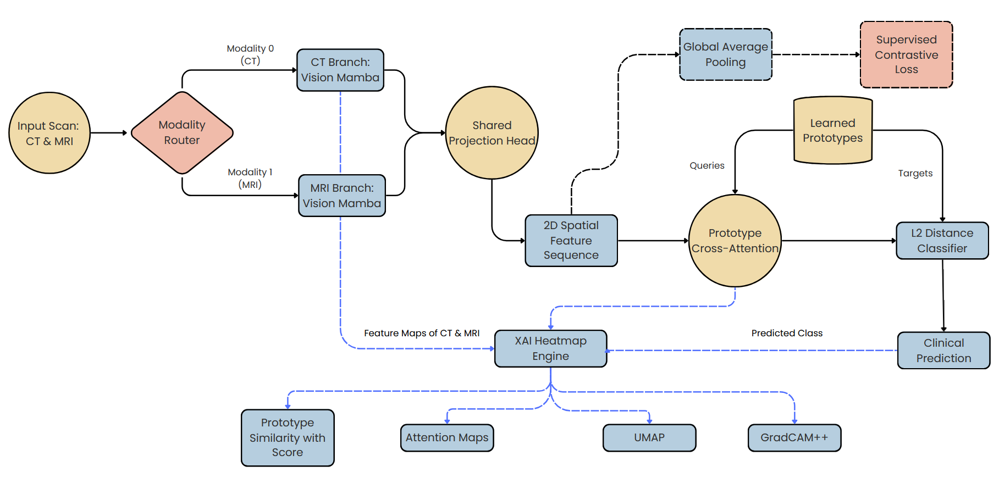

# Brain Tumor Detection Multimodal (CT + MRI)

## Proposed Approach

This repository presents an interpretable multimodal deep learning framework for **binary brain tumor detection** using **CT** and **MRI** brain images.

The proposed framework employs **Vision Mamba** as the feature extraction backbone for both imaging modalities. Modality-specific features are projected into a shared embedding space and optimized using **Supervised Contrastive Learning** to improve cross-modal feature alignment. The aligned representations are further refined using **Prototype Cross-Attention** with learnable prototypes, followed by an **L2 Distance Classifier** for binary classification (**Healthy** or **Tumor**).

To enhance model interpretability, the framework integrates multiple **Explainable AI (XAI)** techniques, including **Grad-CAM++**, **Attention Maps**, **Prototype Similarity Analysis**, and **UMAP Visualization**.

---


# Repository Structure

```text
Brain-Tumor-Detection-Multimodal-CT-MRI/
│
├── Dataset/
│   └── README.md
│
├── Model_code.ipynb
├── model_architecture.png
├── requirements.txt
└── README.md
```

---

# Files

## Model_code.ipynb

Contains the complete implementation of the proposed multimodal brain tumor detection framework, including:

- Data preprocessing
- Vision Mamba feature extraction
- Shared Projection Head
- Supervised Contrastive Learning
- Prototype Cross-Attention
- Learnable Prototypes
- L2 Distance Classification
- Model training
- Model evaluation
- Explainable AI (Grad-CAM++, Attention Maps, Prototype Similarity Analysis, and UMAP Visualization)

---

## model_architecture.png

Illustrates the complete architecture of the proposed multimodal brain tumor detection framework.
<p align="center">
  
</p>


---

##  Dataset

Contains:

- Dataset download links
- Dataset descriptions
- Dataset statistics
- Directory structure
- Setup instructions

For more details, see:

```text
Dataset/README.md
```
> **NOTE:** Update the dataset paths inside **Model_code.ipynb** before executing the notebook.

---

##  requirements.txt

Install all required packages using:

```bash
pip install -r requirements.txt
```
---

#  Running the Project

1. Download both datasets using the links provided in `Dataset/README.md`.
2. Extract and organize the datasets.
3. Update the dataset paths inside `Model_code.ipynb`.
4. Install the required packages.

```bash
pip install -r requirements.txt
```

5. Open **Model_code.ipynb** using **Google Colab** or **Jupyter Notebook**.
6. Run all notebook cells sequentially from top to bottom.

---

#  Model Components

- Vision Mamba Backbone
- Shared Projection Head
- Supervised Contrastive Learning
- Prototype Cross-Attention
- Learnable Prototypes
- L2 Distance Classifier
- Explainable AI (Grad-CAM++)
- Attention Maps
- Prototype Similarity Analysis
- UMAP Visualization

---

#  Explainable AI (XAI)

The framework incorporates multiple Explainable AI techniques to improve model interpretability.

- Grad-CAM++
- Attention Maps
- Prototype Similarity Analysis
- UMAP Feature Visualization

These techniques help visualize the model's decision-making process and highlight clinically relevant image regions.

---

#  Key Features

-  Multimodal Brain Tumor Detection (CT + MRI)
-  Vision Mamba Feature Extraction
-  Supervised Contrastive Learning
-  Prototype Cross-Attention
-  Learnable Prototypes
-  L2 Distance Classification
-  Explainable AI (Grad-CAM++)
-  Attention Maps
-  Prototype Similarity Analysis
-  UMAP Visualization
-  Binary Classification (Healthy vs. Tumor)

---

#  Results

The proposed multimodal framework is designed to provide accurate and interpretable **binary brain tumor detection** by effectively leveraging complementary information from CT and MRI modalities.
